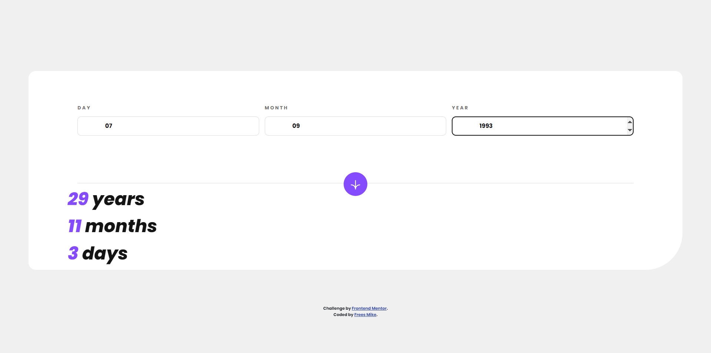

# Frontend Mentor - Age calculator app solution

This is a solution to the [Age calculator app challenge on Frontend Mentor](https://www.frontendmentor.io/challenges/age-calculator-app-dF9DFFpj-Q). Frontend Mentor challenges help you improve your coding skills by building realistic projects. 

## Table of contents

- [Overview](#overview)
  - [The challenge](#the-challenge)
  - [Screenshot](#screenshot)
  - [Links](#links)
- [My process](#my-process)
  - [Built with](#built-with)
  - [What I learned](#what-i-learned)
  - [Continued development](#continued-development)
- [Author](#author)

## Overview

### The challenge

Users should be able to:

- View an age in years, months, and days after submitting a valid date through the form
- Receive validation errors if:
  - Any field is empty when the form is submitted
  - The day number is not between 1-31
  - The month number is not between 1-12
  - The year is in the future
  - The date is invalid e.g. 31/04/1991 (there are 30 days in April)
- View the optimal layout for the interface depending on their device's screen size
- See hover and focus states for all interactive elements on the page
- **Bonus**: See the age numbers animate to their final number when the form is submitted

### Screenshot

### Links

- [Solution URL](https://github.com/mikeFrees/age-calculator-app-main)
- [Live Site URL](https://mikefrees.github.io/age-calculator-app-main/)

## My process

### Built with

- Semantic HTML5 markup
- CSS custom properties
- Flexbox
- CSS Grid
- Mobile-first workflow
- ES6
- NPM
- Google fonts API
- DOM manipulation
- Error handeling

### What I learned

I learned how to manipulate the DOM via ES6 and how to use animations. I had some trouble with stopping and starting an animation again once it finished playing.

Most of my time on this project was spent on the programming part and the logic behind the age calculation. I had some fun with how to calculate the age of somebody that was born on the 29th of february on a leap year. And how to calculate if somebody beat the record of oldest living person.

I had a lot of fun programming this and will start a new challenge soon.

### Continued development

I an going to focus on how to optimize my HTML/CSS and try to learn how to use the cli better.

## Author

- LinkedIn - [Frees Mike](https://www.linkedin.com/in/mike-frees/)
- Frontend Mentor Profile - [Mike Frees](https://www.frontendmentor.io/profile/mikeFrees)
